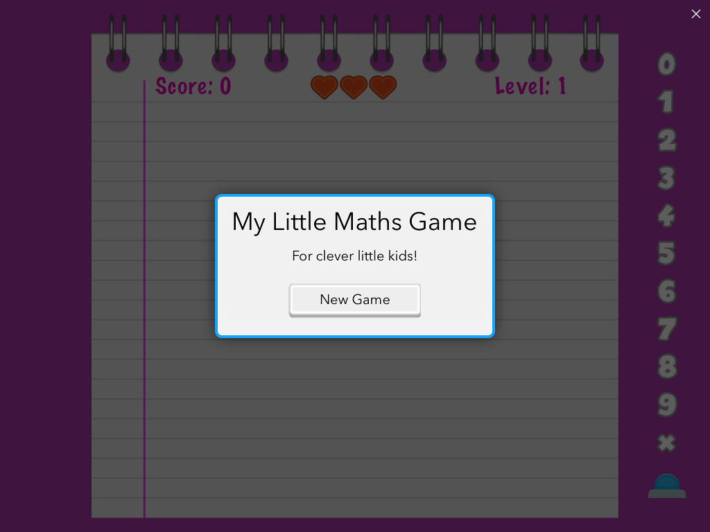

# myMaths

Simple Pythonista Maths game for children. It presents 5 operations (currently only additions) per level.

Some sample screenshots:

Additions and improvements welcome - please clone & create pull requests!!!

Contact: cvarelaruiz@gmail.com

